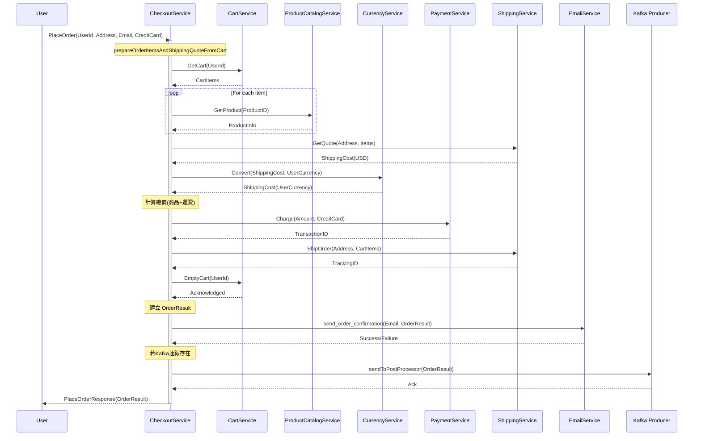

<!-- markdownlint-disable-next-line -->

# `` OpenTelemetry Demo

[](https://cloud-native.slack.com/archives/C03B4CWV4DA)
[](https://github.com/open-telemetry/opentelemetry-demo/releases)
[](https://github.com/open-telemetry/opentelemetry-demo/graphs/commit-activity)
[](https://hub.docker.com/r/otel/demo)
[](https://github.com/open-telemetry/opentelemetry-demo/blob/main/LICENSE)
[](https://github.com/open-telemetry/opentelemetry-demo/actions/workflows/run-integration-tests.yml)
[](https://artifacthub.io/packages/helm/opentelemetry-helm/opentelemetry-demo)
[](https://www.bestpractices.dev/en/projects/9247)

## Required

Docker compose version >= 2.20.3

## Start the demo

1. `make build`
2. `docker compose -f compose.yml up -d` or `make start`

## Verify the web store and Telemetry

Once the images are built and containers are started you can access:

- Web store: [http://localhost:8080/](http://localhost:8080/)
- Grafana: [http://localhost:8080/grafana/](http://localhost:8080/grafana/)
- Load Generator UI: [http://localhost:8080/loadgen/](http://localhost:8080/loadgen/)
- Jaeger UI: [http://localhost:8080/jaeger/ui/](http://localhost:8080/jaeger/ui/)
- Tracetest UI: [http://localhost:11633/](http://localhost:11633/), only when using
  `make run-tracetesting`
- Flagd configurator UI: [http://localhost:8080/feature](http://localhost:8080/feature)


## 補充

剛好有朋友問到, 當初 meetup 我沒特別提這工具的部份 補充一下給自己在加強記憶

Grafana Loki 其實在版本當採用 OTLP 作為 Distributor 接收的協議時，會透過把一些 context作為strcturue metadata 來使用 , 但這些不會成為 index label 的. 用法會有點不直覺. 當然 Alloy 有好的方式能處理. [https://grafana.com/docs/alloy/latest/reference/components/otelcol/otelcol.exporter.loki/](https://grafana.com/docs/alloy/latest/reference/components/otelcol/otelcol.exporter.loki/)

在 Loki otlp 設定區塊中, 有這麼一段話, 只有 Resource Attributes才能成為 index label.
  attributes_config:

# It additionally allows# index_label action for Resource Attributes

[https://github.com/grafana/loki/blob/c99771efb875abd905a77c917a5805a6228a4315/docs/sources/send-data/otel/_index.md?plain=1#L157](https://github.com/grafana/loki/blob/c99771efb875abd905a77c917a5805a6228a4315/docs/sources/send-data/otel/_index.md?plain=1#L157)

那麼哪些是 Loki 的 Resource Attributes? 原始程式碼在連結, 自個看
[https://github.com/grafana/loki/blob/c99771efb875abd905a77c917a5805a6228a4315/pkg/loghttp/push/otlp_config.go#L54](https://github.com/grafana/loki/blob/c99771efb875abd905a77c917a5805a6228a4315/pkg/loghttp/push/otlp_config.go#L54)

但我想要的偏偏不在這內建的之中, 怎辦?
不怕!! 反正只要是 Resource Attributes 就能的話, 那我就前處理加上就好, 因此當初為了meetup演示,  OTel collector 用上了  transform processor 的 set 功能. 原始程式碼在連結, 自個看
[https://github.com/tedmax100/devops_meetup/blob/main/src/otelcollector/otelcol-config.yml#L115-L132C91](https://github.com/tedmax100/devops_meetup/blob/main/src/otelcollector/otelcol-config.yml#L115-L132C91)

這時候我就能把我要的 label 設定成 index label 了, 原始程式碼在連結, 自個看
[https://github.com/tedmax100/devops_meetup/blob/main/src/loki/loki.yaml#L57](https://github.com/tedmax100/devops_meetup/blob/main/src/loki/loki.yaml#L57)

山不轉路轉  (我也曾忘記跟誰說過, 我覺得 OTel pipeline有點像在玩資料清洗跟轉換 XDD)

相關的議題, 其實在 Loki issue中也被討論著
[https://github.com/grafana/loki/issues/13456](https://github.com/grafana/loki/issues/13456)

---

補充上 OTLP log 其實長這樣, 自定義的肯定都在 logRecords.attributes 中. 但那個其實太動態了, 且肯定超高基數 <--- 懂了吧? Loki 完全不吃超高基數的. 想到這點才又想到自己欠了一篇仔細分析 Loki 的stream 跟label之間的文章

```json
{
  "resource": {
    "attributes": {
      "service.name": "example-service",
      "service.namespace": "example-namespace",
      "service.instance.id": "instance-12345",
      "service.version": "1.0.0",
      "host.name": "example-host",
      "host.id": "host-12345",
      "cloud.provider": "aws",
      "cloud.region": "us-west-2"
    }
  },
  "instrumentationLibrary": {
    "name": "example-logger",
    "version": "0.1.0"
  },
  "logRecords": [
    {
      "timeUnixNano": "1625241600000000000",
      "severityText": "INFO",
      "severityNumber": 9,
      "name": "example-log",
      "body": {
        "stringValue": "This is an example log message"
      },
      "attributes": {
        "http.method": "GET",
        "http.url": "https://example.com/api/resource",
        "http.status_code": 200,
        "db.system": "mysql",
        "db.statement": "SELECT * FROM users WHERE id = ?"
      },
      "traceId": "4bf92f3577b34da6a3ce929d0e0e4736",
      "spanId": "00f067aa0ba902b7",
      "flags": 1,
      "droppedAttributesCount": 0
    }
  ]
}
```

# Place Order Sequence Diagram



說明：

- 使用者 (User) 呼叫 PlaceOrder 進行結帳。
- CheckoutService 先向 CartService 取得購物車內容，再依據產品目錄(ProductCatalogService)取得商品資訊、向 ShippingService 詢價並對運費進行貨幣轉換(CurrencyService)。
- 計算整體金額後向 PaymentService 請求扣款，成功後向 ShippingService 下單出貨並清空購物車(CartService)。
- 將訂單結果通知EmailService寄送通知信。
- 若有 Kafka，則將訂單資訊送入Kafka做後續處理。
- 最後返回 PlaceOrderResponse 給使用者。

## Welcome to the OpenTelemetry Astronomy Shop Demo

This repository contains the OpenTelemetry Astronomy Shop, a microservice-based
distributed system intended to illustrate the implementation of OpenTelemetry in
a near real-world environment.

Our goals are threefold:

- Provide a realistic example of a distributed system that can be used to
  demonstrate OpenTelemetry instrumentation and observability.
- Build a base for vendors, tooling authors, and others to extend and
  demonstrate their OpenTelemetry integrations.
- Create a living example for OpenTelemetry contributors to use for testing new
  versions of the API, SDK, and other components or enhancements.

We've already made [huge
progress](https://github.com/open-telemetry/opentelemetry-demo/blob/main/CHANGELOG.md),
and development is ongoing. We hope to represent the full feature set of
OpenTelemetry across its languages in the future.

If you'd like to help (**which we would love**), check out our [contributing
guidance](./CONTRIBUTING.md).

If you'd like to extend this demo or maintain a fork of it, read our
[fork guidance](https://opentelemetry.io/docs/demo/forking/).

## Quick start

You can be up and running with the demo in a few minutes. Check out the docs for
your preferred deployment method:

- [Docker](https://opentelemetry.io/docs/demo/docker_deployment/)
- [Kubernetes](https://opentelemetry.io/docs/demo/kubernetes_deployment/)

## Documentation

For detailed documentation, see [Demo Documentation][docs]. If you're curious
about a specific feature, the [docs landing page][docs] can point you in the
right direction.

## Demos featuring the Astronomy Shop

We welcome any vendor to fork the project to demonstrate their services and
adding a link below. The community is committed to maintaining the project and
keeping it up to date for you.

|                                                    |                              |                                                                  |
| -------------------------------------------------- | ---------------------------- | ---------------------------------------------------------------- |
| [AlibabaCloud LogService][AlibabaCloud LogService] | [Elastic][Elastic]           | [OpenSearch][OpenSearch]                                         |
| [AppDynamics][AppDynamics]                         | [Google Cloud][Google Cloud] | [Sentry][Sentry]                                                 |
| [Aspecto][Aspecto]                                 | [Grafana Labs][Grafana Labs] | [ServiceNow Cloud Observability][ServiceNow Cloud Observability] |
| [Axiom][Axiom]                                     | [Guance][Guance]             | [Splunk][Splunk]                                                 |
| [Axoflow][Axoflow]                                 | [Honeycomb.io][Honeycomb.io] | [Sumo Logic][Sumo Logic]                                         |
| [Azure Data Explorer][Azure Data Explorer]         | [Instana][Instana]           | [TelemetryHub][TelemetryHub]                                     |
| [Coralogix][Coralogix]                             | [Kloudfuse][Kloudfuse]       | [Teletrace][Teletrace]                                           |
| [Dash0][Dash0]                                     | [Liatrio][Liatrio]           | [Tracetest][Tracetest]                                           |
| [Datadog][Datadog]                                 | [Logz.io][Logz.io]           | [Uptrace][Uptrace]                                               |
| [Dynatrace][Dynatrace]                             | [New Relic][New Relic]       |                                                                  |

## Contributing

To get involved with the project see our [CONTRIBUTING](CONTRIBUTING.md)
documentation. Our [SIG Calls](CONTRIBUTING.md#join-a-sig-call) are every other
Monday at 8:30 AM PST and anyone is welcome.

## Project leadership

[Maintainers](https://github.com/open-telemetry/community/blob/main/guides/contributor/membership.md#maintainer)
([@open-telemetry/demo-maintainers](https://github.com/orgs/open-telemetry/teams/demo-maintainers)):

- [Juliano Costa](https://github.com/julianocosta89), Datadog
- [Mikko Viitanen](https://github.com/mviitane), Dynatrace
- [Pierre Tessier](https://github.com/puckpuck), Honeycomb

[Approvers](https://github.com/open-telemetry/community/blob/main/guides/contributor/membership.md#approver)
([@open-telemetry/demo-approvers](https://github.com/orgs/open-telemetry/teams/demo-approvers)):

- [Cedric Ziel](https://github.com/cedricziel) Grafana Labs
- [Penghan Wang](https://github.com/wph95), AppDynamics
- [Reiley Yang](https://github.com/reyang), Microsoft
- [Roger Coll](https://github.com/rogercoll), Elastic
- [Ziqi Zhao](https://github.com/fatsheep9146), Alibaba

Emeritus:

- [Austin Parker](https://github.com/austinlparker)
- [Carter Socha](https://github.com/cartersocha)
- [Michael Maxwell](https://github.com/mic-max)
- [Morgan McLean](https://github.com/mtwo)

### Thanks to all the people who have contributed

[](https://github.com/open-telemetry/opentelemetry-demo/graphs/contributors)

<!-- Links for Demos featuring the Astronomy Shop section -->

[docs]: https://opentelemetry.io/docs/demo/
[AlibabaCloud LogService]: https://github.com/aliyun-sls/opentelemetry-demo
[AppDynamics]: https://www.appdynamics.com/blog/cloud/how-to-observe-opentelemetry-demo-app-in-appdynamics-cloud/
[Aspecto]: https://github.com/aspecto-io/opentelemetry-demo
[Axiom]: https://play.axiom.co/axiom-play-qf1k/dashboards/otel.traces.otel-demo-traces
[Axoflow]: https://axoflow.com/opentelemetry-support-in-more-detail-in-axosyslog-and-syslog-ng/
[Azure Data Explorer]: https://github.com/Azure/Azure-kusto-opentelemetry-demo
[Coralogix]: https://coralogix.com/blog/configure-otel-demo-send-telemetry-data-coralogix
[Dash0]: https://github.com/dash0hq/opentelemetry-demo
[Datadog]: https://docs.datadoghq.com/opentelemetry/guide/otel_demo_to_datadog
[Dynatrace]: https://www.dynatrace.com/news/blog/opentelemetry-demo-application-with-dynatrace/
[Elastic]: https://github.com/elastic/opentelemetry-demo
[Google Cloud]: https://github.com/GoogleCloudPlatform/opentelemetry-demo
[Grafana Labs]: https://github.com/grafana/opentelemetry-demo
[Guance]: https://github.com/GuanceCloud/opentelemetry-demo
[Honeycomb.io]: https://github.com/honeycombio/opentelemetry-demo
[Instana]: https://github.com/instana/opentelemetry-demo
[Kloudfuse]: https://github.com/kloudfuse/opentelemetry-demo
[Liatrio]: https://github.com/liatrio/opentelemetry-demo
[Logz.io]: https://logz.io/learn/how-to-run-opentelemetry-demo-with-logz-io/
[New Relic]: https://github.com/newrelic/opentelemetry-demo
[OpenSearch]: https://github.com/opensearch-project/opentelemetry-demo
[Sentry]: https://github.com/getsentry/opentelemetry-demo
[ServiceNow Cloud Observability]: https://docs.lightstep.com/otel/quick-start-operator#send-data-from-the-opentelemetry-demo
[Splunk]: https://github.com/signalfx/opentelemetry-demo
[Sumo Logic]: https://www.sumologic.com/blog/common-opentelemetry-demo-application/
[TelemetryHub]: https://github.com/TelemetryHub/opentelemetry-demo/tree/telemetryhub-backend
[Teletrace]: https://github.com/teletrace/opentelemetry-demo
[Tracetest]: https://github.com/kubeshop/opentelemetry-demo
[Uptrace]: https://github.com/uptrace/uptrace/tree/master/example/opentelemetry-demo
